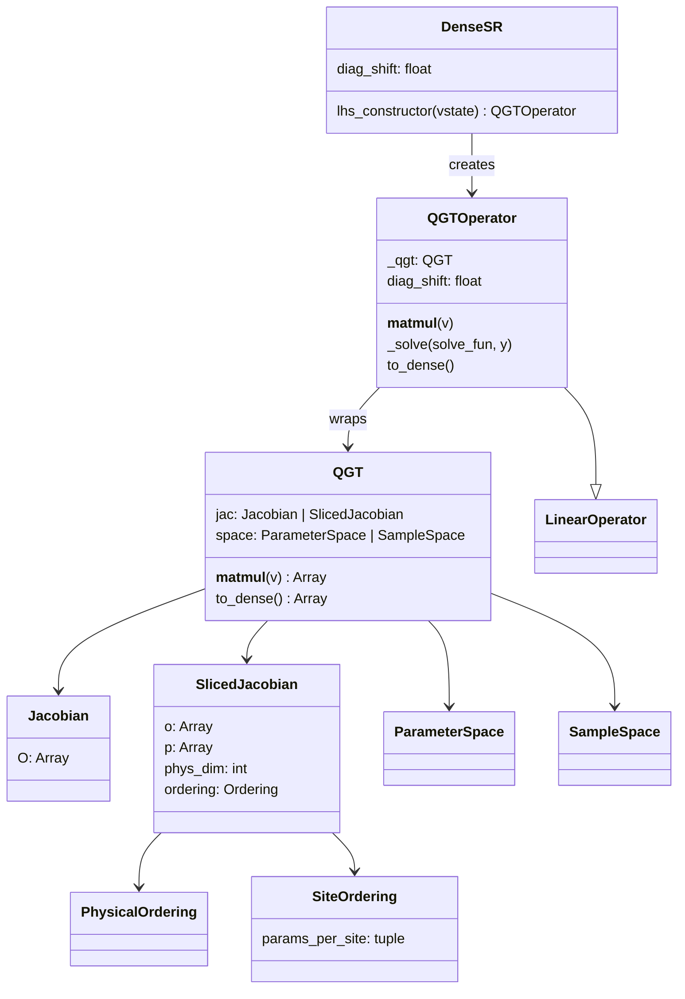
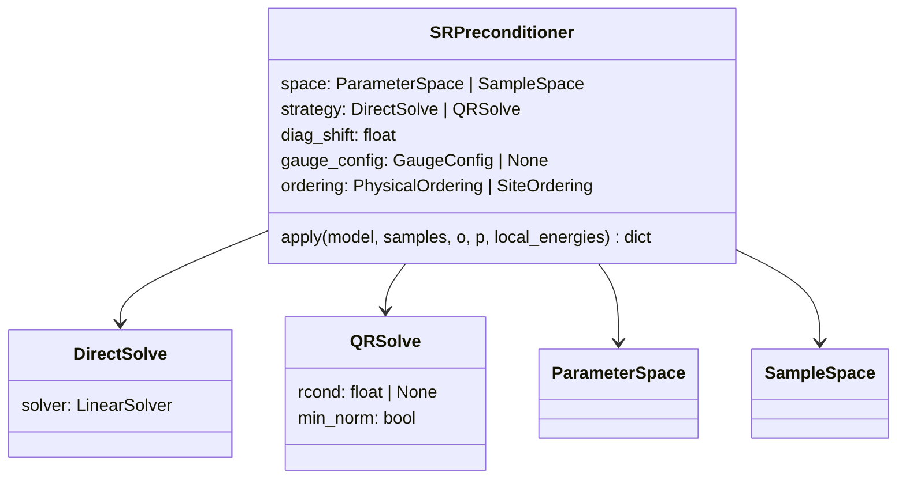
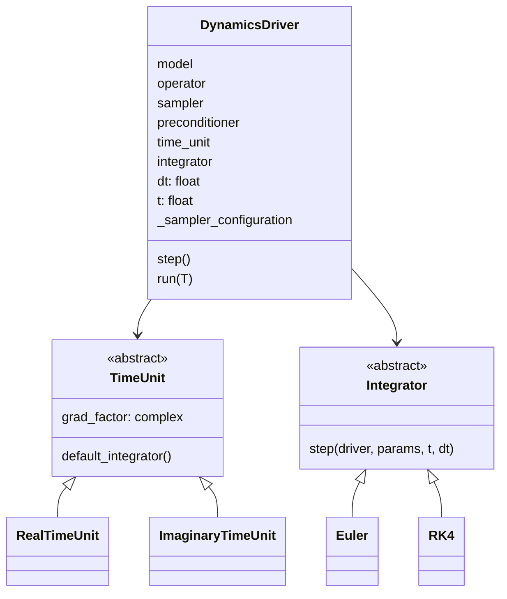
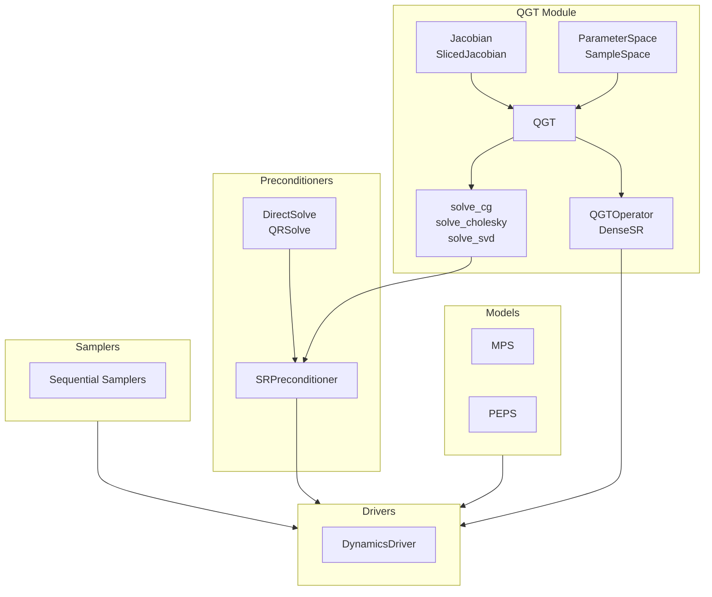

# VMC Design Overview

## Package Layout (src)
- `src/vmc/config.py`: JAX x64 setup and logging config (`VMC_LOG_LEVEL`).
- `src/vmc/core/eval.py`: Unified eval API (`_value`, `_grad`, `_value_and_grad`) with plum dispatch.
- `src/vmc/models/mps.py`: `MPS` open-boundary model; `MPS.site_dims` for boundary bond sizes.
- `src/vmc/models/peps.py`: `PEPS` open-boundary model; `PEPS.site_dims`, contraction strategies, VJP; dispatched `bottom_envs`, `grads_and_energy`, `sweep`.
- `src/vmc/experimental/lgt/gi_peps.py`: `GIPEPS` gauge-invariant PEPS; dispatch overloads for `bottom_envs`, `grads_and_energy`, `sweep`.
- `src/vmc/experimental/lgt/gi_sampler.py`: GIPEPS-specific sampler (dispatched `sequential_sample_with_gradients`).
- `src/vmc/samplers/sequential.py`: Sequential Metropolis samplers for MPS/PEPS; unified `sequential_sample_with_gradients`.
- `src/vmc/qgt/*`: QGT, Jacobians, solvers, NetKet compatibility.
- `src/vmc/preconditioners/preconditioners.py`: SR/QGT preconditioners and solvers.
- `src/vmc/drivers/custom_driver.py`: time evolution drivers and integrators.
- `src/vmc/utils/vmc_utils.py`: Jacobian helpers, batching, local energy.
- `src/vmc/utils/smallo.py`: `params_per_site` (uses model static site dims).

## Core Eval API
- `_value(model, sample)`: amplitude; auto-vmaps for 2D samples.
- `_grad(model, sample)`: gradient; wraps `_value_and_grad`.
- `_value_and_grad(model, sample)`: amplitude + gradient; base entrypoint.

## Models
- `MPS`: site tensors `(phys_dim, D_left, D_right)` with open boundaries.
- `PEPS`: site tensors `(phys_dim, up, down, left, right)` with open boundaries.
- `MPS.site_dims` / `PEPS.site_dims`: boundary-aware bond sizes used by eval/sampling.

## PEPS Contraction + Gradients
- `ContractionStrategy` ABC with `NoTruncation`, `ZipUp`, `DensityMatrix`.
- `PEPS.apply`: static method with custom-VJP using cached environments.
- `_compute_all_gradients`: environment-based row gradients.

## PEPS Dispatched API
Dispatched functions for PEPS/GIPEPS (plum `@dispatch`):
- `bottom_envs(model, sample)`: compute bottom boundary environments.
- `grads_and_energy(model, sample, amp, operator, envs)`: compute gradients and local energy using pre-computed envs.
- `sweep(model, sample, key, envs)`: single Metropolis sweep, returns `(new_sample, key, amp)`.

GIPEPS overloads in `gi_peps.py` use `@bottom_envs.dispatch`, `@grads_and_energy.dispatch`, `@sweep.dispatch`.

## GI-PEPS (Gauge-Invariant PEPS)
- `GIPEPS`: gauge-invariant PEPS with site tensors + link variables.
- Sample format: flat array containing sites, h_links, v_links (use `flatten_sample`/`unflatten_sample`).
- Sweep phases: plaquette → horizontal links → vertical links.
- Environment reuse: 1-row envs for gradient/single-site/horizontal; 2-row envs for vertical/plaquette.

## Sampling
- `sequential_sample`: sequential Metropolis for MPS/PEPS.
- `sequential_sample_with_gradients`: unified sampling + gradient collection for PEPS/GIPEPS.
  - Uses dispatched `sweep`, `bottom_envs`, `grads_and_energy` internally.
  - Single `jax.vmap` over entire `mc_sweep` pipeline (sweep → envs → grads → flatten).
  - `jax.lax.scan` for repeated sweeps with environment reuse between iterations.
- Stateful sampling threads `(final_configurations, key)` for reproducible chains.

## QGT
- `Jacobian` / `SlicedJacobian` with `PhysicalOrdering` / `SiteOrdering`.
- `QGT`: lazy matvec in parameter or sample space.
- `QGTOperator` / `DenseSR`: NetKet compatibility wrappers.

## Class Diagrams

### QGT

### Preconditioners

### Drivers

## Flowchart

