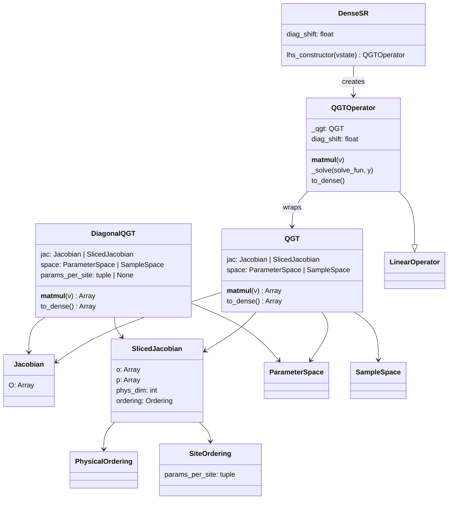
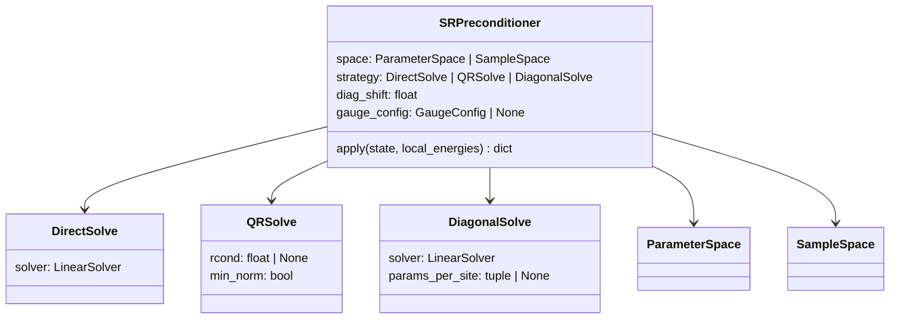
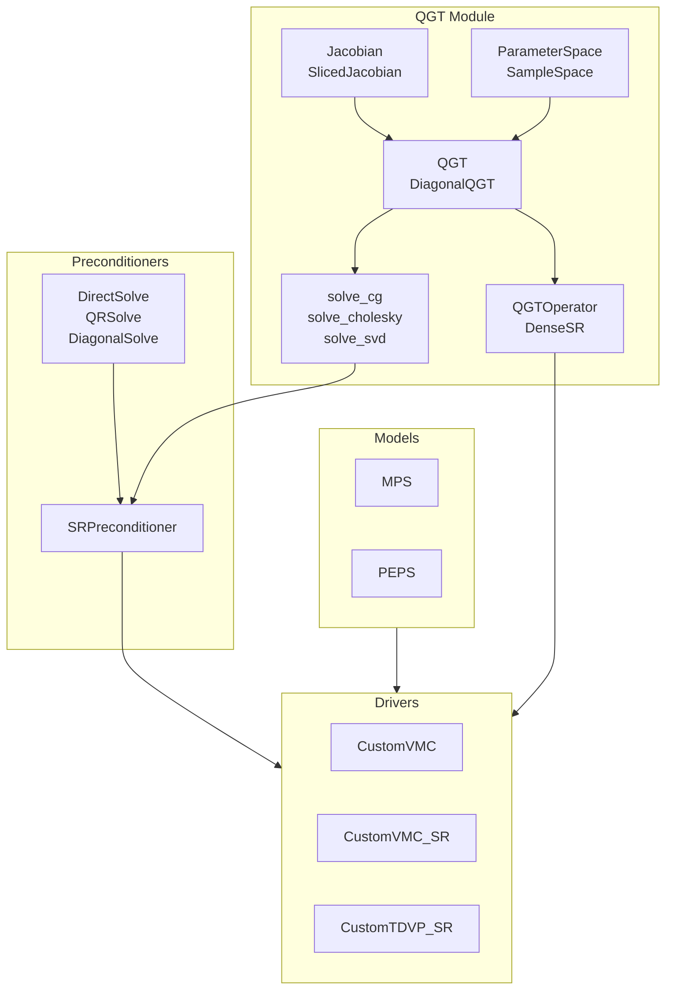

## VMC inventory

### Configuration
- `VMC/config.py`: JAX x64 setup and logging config (VMC_LOG_LEVEL).

### Models
- `VMC/models/mps.py`: `MPS` open-boundary MPS log-amplitude model.
- `VMC/models/peps.py`: `PEPS` open-boundary PEPS with boundary-MPS contraction.

### Contraction + Amplitudes (PEPS)
- `VMC/models/peps.py`: `ContractionStrategy` ABC with `NoTruncation`, `ZipUp`, `DensityMatrix`.
- `VMC/models/peps.py`: Custom-VJP amplitude pipeline and environment-gradient helpers.

### Drivers
- `VMC/drivers/custom_driver.py`: `Integrator` ABC (`Euler`, `RK4`), `PropagationType` ABC (`RealTime`, `ImaginaryTime`).
- `VMC/drivers/custom_driver.py`: `CustomVMC`, `CustomVMC_SR`, `CustomVMC_QR`, `CustomTDVP_SR`.

### QGT Module
- `VMC/qgt/jacobian.py`: `Jacobian`, `SlicedJacobian`, `PhysicalOrdering`, `SiteOrdering`.
- `VMC/qgt/qgt.py`: `QGT`, `DiagonalQGT`, `ParameterSpace`, `SampleSpace` with lazy matvec via plum dispatch.
- `VMC/qgt/solvers.py`: `solve_cg`, `solve_cholesky`, `solve_svd`.
- `VMC/qgt/netket_compat.py`: `QGTOperator`, `DenseSR` (NetKet LinearOperator adapter).

### Preconditioners
- `VMC/preconditioners/preconditioners.py`: `DirectSolve`, `QRSolve`, `DiagonalSolve`, `SRPreconditioner`.

### Gauge
- `VMC/gauge/gauge.py`: `GaugeConfig`, `compute_gauge_projection` for MPS.

### Utilities
- `VMC/utils/vmc_utils.py`: `flatten_samples`, `get_apply_fun`, `build_dense_jac`.

## QGT Class Diagram

## Preconditioner Class Diagram

## Flowchart

