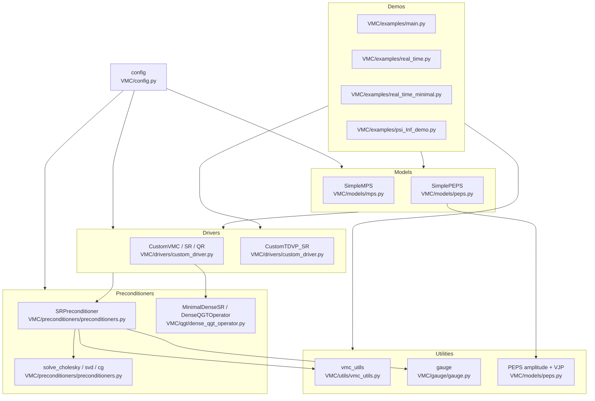

## VMC inventory

### Configuration
- `VMC/config.py`: JAX x64 setup and logging config (VMC_LOG_LEVEL).

### Models
- `VMC/models/mps.py`: `SimpleMPS` open-boundary MPS log-amplitude model.
- `VMC/models/peps.py`: `SimplePEPS` open-boundary PEPS with boundary-MPS contraction.

### Contraction + Amplitudes (PEPS)
- `VMC/models/peps.py`: `ContractionStrategy` ABC with `NoTruncation`, `ZipUp`, `DensityMatrix`.
- `VMC/models/peps.py`: Custom-VJP amplitude pipeline (`make_peps_amplitude`, `peps_amplitude`) and environment-gradient helpers.

### Drivers
- `VMC/drivers/custom_driver.py`: `Integrator` ABC (`Euler`, `RK4`), `PropagationType` ABC (`RealTime`, `ImaginaryTime`).
- `VMC/drivers/custom_driver.py`: `CustomVMC`, `CustomVMC_SR`, `CustomVMC_QR`, `CustomTDVP_SR`.

### Preconditioners + Solvers
- `VMC/preconditioners/preconditioners.py`: `SRFormulation`, `MinSRFormulation`, `DirectSolve`, `QRSolve`.
- `VMC/preconditioners/preconditioners.py`: `solve_cholesky`, `solve_svd`, `solve_cg`, and `SRPreconditioner`.

### QGT
- `VMC/qgt/dense_qgt_operator.py`: `DenseQGTOperator`, `MinimalDenseSR`.

### Gauge
- `VMC/gauge/gauge.py`: `GaugeConfig`, `compute_gauge_projection` for MPS (PEPS gauge removal not implemented).

### Utilities
- `VMC/utils/vmc_utils.py`: `flatten_samples`, `get_apply_fun`, `build_dense_jac`, `build_dense_jac_from_state`.

### Demos
- `VMC/examples/main.py`: VMC comparisons (custom vs NetKet SR/QGT) on Heisenberg square.
- `VMC/examples/real_time.py`: TDVP vs exact dynamics; MPS/PEPS fidelity comparisons.
- `VMC/examples/real_time_minimal.py`: Minimal TDVP loops + custom sampling (MPS sequential/random-flip, PEPS Gibbs/sequential).
- `VMC/examples/psi_Inf_demo.py`: MPSOpen log-amplitude finite vs `-inf` playground.

## Flowchart

