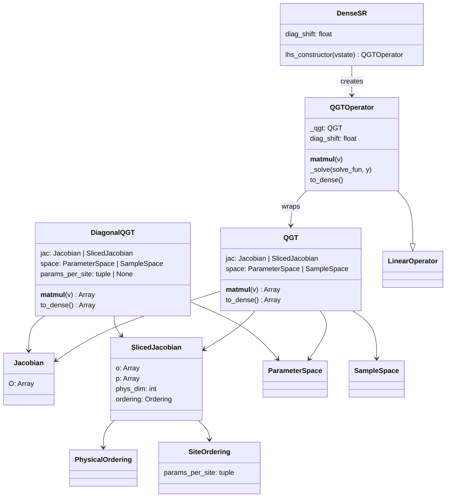
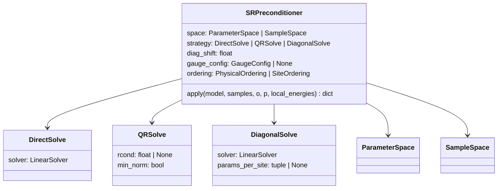
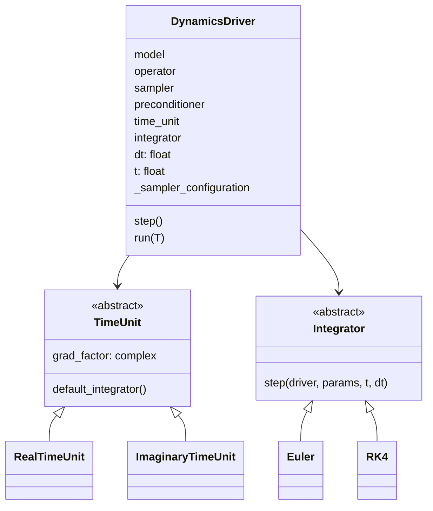
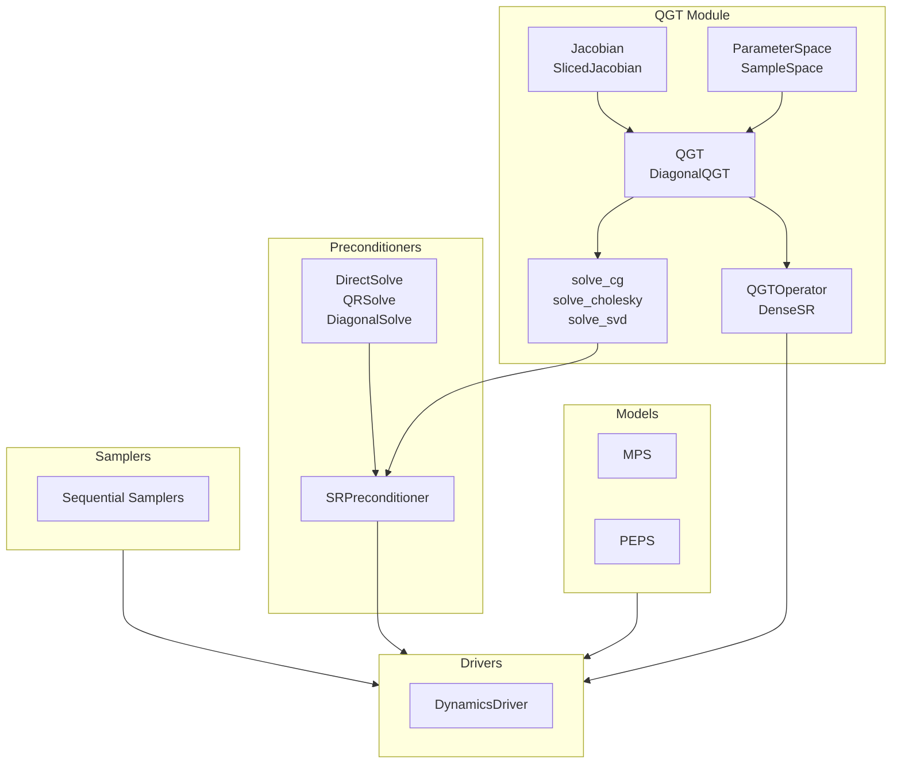

## VMC inventory

### Configuration
- `VMC/config.py`: JAX x64 setup and logging config (VMC_LOG_LEVEL).

### Core Eval API
- `VMC/core/eval.py`: Unified evaluation entrypoints with plum dispatch.
  - `_value(model, sample)`: Compute amplitude. Auto-vmaps if `sample.ndim == 2`.
  - `_grad(model, sample)`: Compute gradient. Auto-vmaps if `sample.ndim == 2`.
  - `_value_and_grad(model, sample)`: Compute amplitude and gradient. Auto-vmaps if `sample.ndim == 2`.
- All batch operations use these same functions—pass 2D arrays for batched evaluation.

### Models
- `VMC/models/mps.py`: `MPS` open-boundary MPS log-amplitude model.
- `VMC/models/peps.py`: `PEPS` open-boundary PEPS with boundary-MPS contraction.

### Contraction + Amplitudes (PEPS)
- `VMC/models/peps.py`: `ContractionStrategy` ABC with `NoTruncation`, `ZipUp`, `DensityMatrix`.
- `VMC/models/peps.py`: Custom-VJP amplitude pipeline and environment-gradient helpers.

### Drivers
- `VMC/drivers/custom_driver.py`: `Integrator` ABC (`Euler`, `RK4`), `TimeUnit` ABC (`RealTimeUnit`, `ImaginaryTimeUnit`).
- `VMC/drivers/custom_driver.py`: `DynamicsDriver` (single model-based driver).
- **Stateful sampler integration**: `DynamicsDriver` maintains `_sampler_configuration` to persist Markov chain state across RK stages and steps. The sampler callable must return `(samples, o, p, key, final_configurations)`.

### Samplers
- `VMC/samplers/sequential.py`: Sequential Metropolis sampler for MPS/PEPS; one recorded sample per sweep; environment reuse during sweeps; gradient recording reuses cached environments.
- `VMC/samplers/sequential.py`: `peps_sequential_sweep` for a single PEPS sweep.
- **Stateful sampling**: `sequential_sample_with_gradients` accepts `initial_configuration` and returns `final_configurations` to persist Markov chain state across calls. Signature:
  ```python
  samples, o, p, key, final_configurations = sequential_sample_with_gradients(
      model, n_samples=..., key=..., initial_configuration=prev_config
  )
  ```

### QGT Module
- `VMC/qgt/jacobian.py`: `Jacobian`, `SlicedJacobian`, `PhysicalOrdering`, `SiteOrdering`.
- `VMC/qgt/qgt.py`: `QGT`, `DiagonalQGT`, `ParameterSpace`, `SampleSpace` with lazy matvec via plum dispatch.
- `VMC/qgt/solvers.py`: `solve_cg`, `solve_cholesky`, `solve_svd`.
- `VMC/qgt/netket_compat.py`: `QGTOperator`, `DenseSR` (NetKet LinearOperator adapter).

### Preconditioners
- `VMC/preconditioners/preconditioners.py`: `DirectSolve`, `QRSolve`, `DiagonalSolve`, `SRPreconditioner` (model/samples-based apply).

### Gauge
- `VMC/gauge/gauge.py`: `GaugeConfig`, `compute_gauge_projection` for MPS.

### Utilities
- `VMC/utils/vmc_utils.py`: `flatten_samples`, `get_apply_fun`, `build_dense_jac`, `local_estimate`.
- `VMC/utils/independent_set_sampling.py`: `IndependentSetSampler`, `DiscardBlockedSampler` for independent-set MCMC (`n_steps` controls MH steps).

## QGT Class Diagram



## Preconditioner Class Diagram



## Driver Class Diagram



## Flowchart


